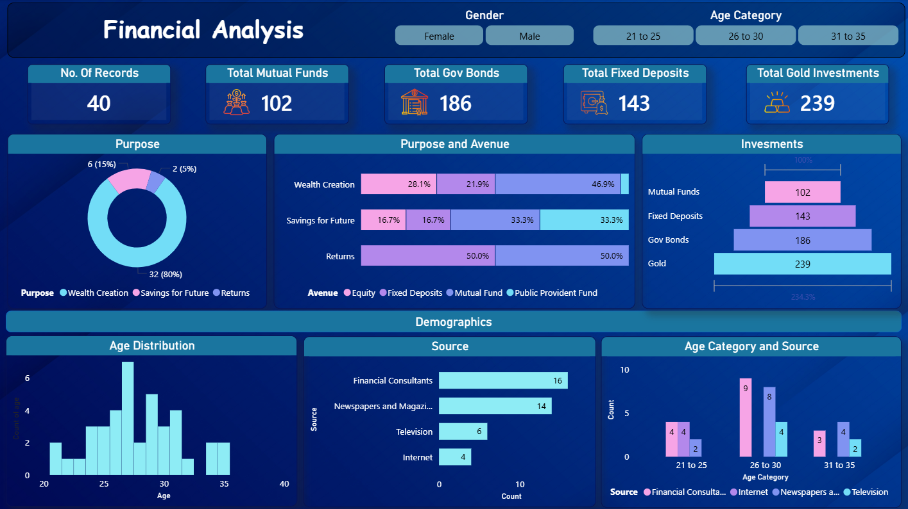

# Financial Investment Analysis - Power BI Dashboard

## Overview

This project analyzes a financial survey dataset using Power BI to understand respondents' investment preferences and financial behavior. The dataset is provided in CSV format.

## Key Questions Analyzed

**1. Age Distribution and Data Sources**
What is the age distribution of respondents and what sources do they use for financial information?

**2. Investment Allocation**
What is the total number of investments in mutual funds, government bonds, fixed deposits, and gold?

**3. Preferred Avenue for Wealth Creation**
Which investment option is chosen by the majority of respondents for wealth creation?

## Tools Used

* Power BI
* Microsoft Excel

## Project Files

* Power BI Dashboard (.pbix)
* Financial Dataset (.csv)
* Dashboard Screenshots

